# Architecture Map

## High-Level Overview

This project provides a collection of standalone bookmarklets. The architecture is simple, focusing on client-side execution within the browser context.

The `index.html` file serves as both the installer interface and the build system, compiling source files into bookmarklet URIs on the fly.

## Component Diagram

```mermaid
graph TD
    %% Nodes
    Index[("🌐 index.html <br/>(Installer UI)")]
    Compiler[("⚙️ compile_bookmarklet.js <br/>(Minifier/Packer)")]
    Utils[("🧰 utils.js <br/>(Shared Library)")]

    subgraph "Content Tools"
        WC[("✂️ Web Clipper")]
        PC[("🏠 Property Clipper")]
        PG[("🔑 Passphrase Gen")]
        CF[("📍 PA County Finder")]
    end

    subgraph "Automation Tools"
        QC[("⚡ Quick Clicker")]
        MB[("🤖 Macro Builder")]
        IR[("🎥 Interaction Recorder")]
        DC[("⏱️ Delayed Clicker")]
    end

    Verifier[("✅ verify_bookmarklet_generation.js")]

    %% Relationships
    Index -->|Fetches & Compiles| Compiler
    Index -->|Injects| Utils
    Index -->|Installs| WC & PC & PG & CF
    Index -->|Installs| QC & MB & IR & DC

    %% Specific Dependencies
    WC -.->|Requires| Utils
    PC -.->|Requires| Utils
    PG -.->|Requires| Utils

    Verifier -->|Validates| WC & PC & PG & CF & QC & MB & IR & DC
    Verifier -->|Uses| Compiler
```

## Key Components

1.  **Distribution (`index.html`)**: The entry point. It fetches source code, injects dependencies, runs the compiler, and generates the drag-and-drop bookmarklet buttons.
2.  **Shared Library (`utils.js`)**: A collection of common functions (DOM manipulation, sanitation, Markdown conversion) used by content-heavy bookmarklets.
3.  **Compiler (`compile_bookmarklet.js`)**: A utility that strips comments and formats code for use in `javascript:` URIs.
4.  **Verification (`verify_bookmarklet_generation.js`)**: A CI/CD script that ensures all bookmarklets compile correctly and adhere to safety standards (e.g., no single-line comments).
